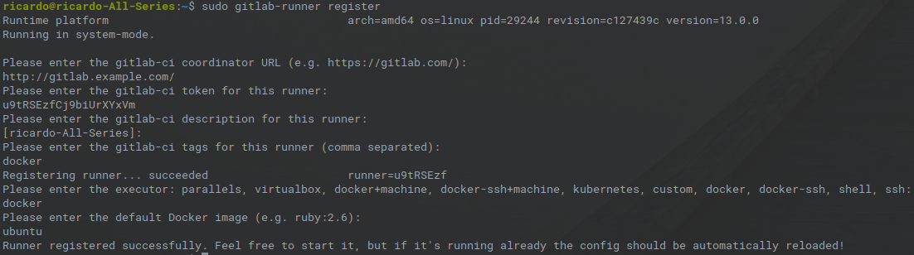
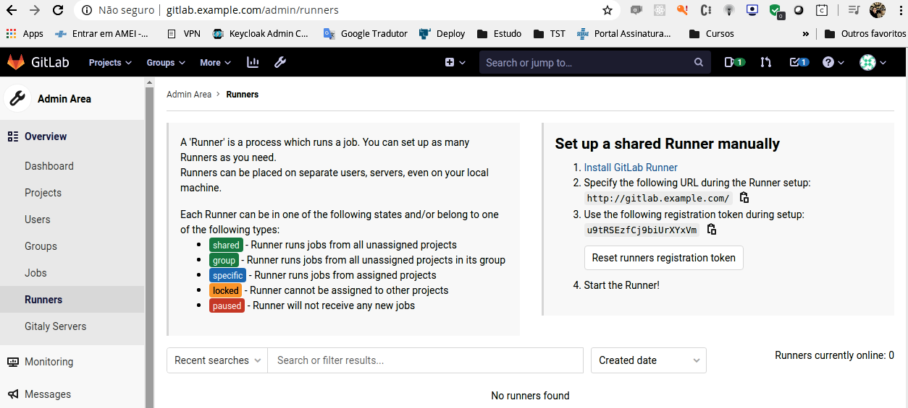

# Pré requisito 

* Instalar a última versão do docker
* Sistema operação Linux

# Instalar docker 

```bash
curl https://get.docker.com | bash
```

# Instalação do Jenkins


* Criar variável apontando para um diretóro de volume docker

```bash
export JENKINS_HOME=~/volume
mkdir ~/volume/jenkins
```

```bash
docker run -d -v $JENKINS_HOME/jenkins:/var/jenkins_home -p 8080:8080 -p 50000:50000 --name jenkins jenkins/jenkins:lts
```

* Comando para verificar o log do jenkins e recuperar o token de acesso.

```bash
 docker logs jenkins
```

Exemplo de token:

91f4600e9d5d437da7e576ffc91ffd6a


* Selecione os plugins desejados
* Preencha os dados para criar um usuário


# Instalação do gitlab


* Criar variável apontando para um diretóro de volume docker

```bash
export GITLAB_HOME=~/volume/
```

* Instalação do gitlab

```bash 
sudo docker run --detach \
  --hostname gitlab.example.com \
  --publish 443:443 --publish 80:80 --publish 22:22 \
  --name gitlab \
  --restart always \
  --volume $GITLAB_HOME/gitlab/config:/etc/gitlab \
  --volume $GITLAB_HOME/gitlab/logs:/var/log/gitlab \
  --volume $GITLAB_HOME/gitlab/data:/var/opt/gitlab \
  gitlab/gitlab-ce:latest
```

* Editar o arquivo hosts e adicionar a entrada gitlab.example.com com seu ip. Exemplo:

```bash
vi /etc/hosts
```
```properties 
192.168.0.8	gitlab.example.com 
127.0.0.1	localhost
```

* defina a senha

Obs.: O usuário padrão é o root.

# Instalação do gitlab-ci

* Instalação do repositório de pacotes debian

```bash
# For Debian/Ubuntu/Mint
curl -L https://packages.gitlab.com/install/repositories/runner/gitlab-runner/script.deb.sh | sudo bash
```

* Instalação do gitlab-runner onde roda as pipeline do gitlab-ci

```bash
# Pacotes https://gitlab-runner-downloads.s3.amazonaws.com/latest/index.html
curl -LJO https://gitlab-runner-downloads.s3.amazonaws.com/latest/deb/gitlab-runner_amd64.deb
```

```bash
# For Debian/Ubuntu/Mint
dpkg -i gitlab-runner_amd64.deb
```

# Configuração do gitlab-ci

* Registrar a máquina que irá rodar o pipeline

```bash
sudo gitlab-runner register
```

Exemplo de configuração:



Caminho do gitlab onde é obtida a url e o token que devem ser informados ao registrar o gitlab-runner.




# Referências

* https://github.com/jenkinsci/docker/blob/master/README.md
* https://www.jenkins.io/doc/book/pipeline/syntax/
* https://docs.gitlab.com/omnibus/docker/
* https://docs.gitlab.com/runner/install/


